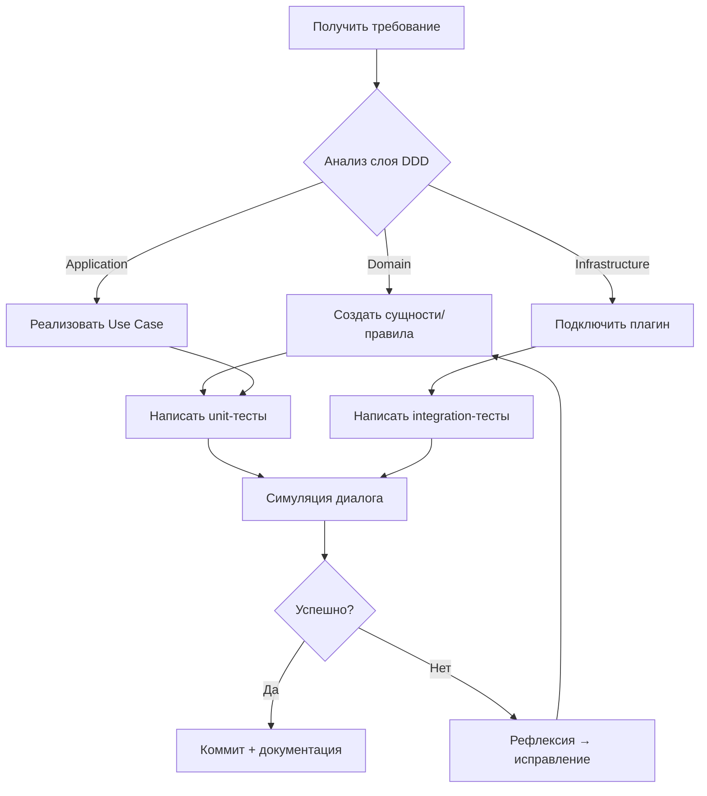
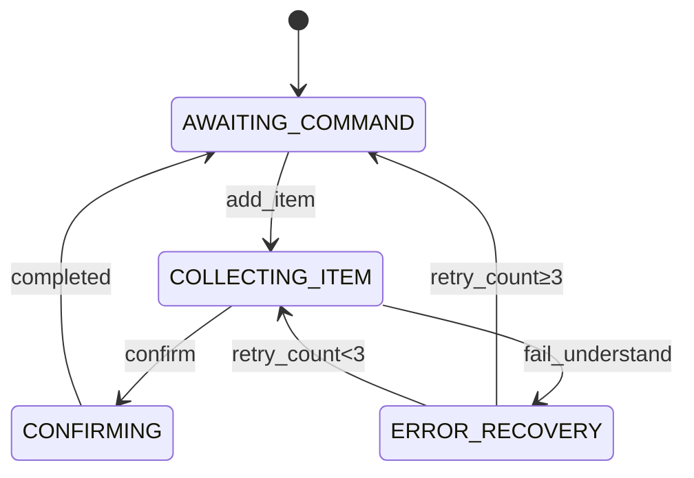

# basic rules.md

Данный проект служит для создания голосовой ассистента для списка дел

# 🤖 Правила для ИИ-агента: Разработка голосового ассистента

*Версия: 1.2 • Дата: 31 января 2026 • Проект: `voice-assistant-core`*

---

## 🧭 1. Философия агента

### 1.1. Принцип «Сначала архитектура, потом код»
> **Правило:** Перед генерацией любого кода агент **обязан**:
> - Подтвердить соответствие слою DDD (`domain` → `application` → `infrastructure`)
> - Указать точный путь файла в структуре проекта
> - Объяснить, как компонент вписывается в диалоговый пайплайн (ASR → NLU → Context → TTS)

### 1.2. Offline-first constraint
> **Запрещено** предлагать решения, требующие:
> - Доступа к интернету во время выполнения
> - GPU-ускорения
> - Облачных API (Google Speech, AWS Polly и т.д.)
> 
> **Разрешены** только проверенные offline-библиотеки:
> - ASR: Vosk, Whisper.cpp
> - TTS: Silero, Piper
> - NLU: scikit-learn, regex, словари

---

## 🧩 2. Паттерны ИИ-агентов для разработки

### 2.1. Рефлексивный цикл (Think → Act → Verify)

```markdown
[THINK] Анализ требования → выбор паттерна → проверка ограничений
   ↓
[ACT]   Генерация кода + документация + тестовые сценарии
   ↓
[VERIFY] Авто-валидация:
         - Соответствие слою DDD
         - Отсутствие внешних зависимостей в `domain/`
         - Обработка ошибок распознавания (retry_count ≥ 3 → fallback)
```

### 2.2. Инструментальный набор агента

| Инструмент | Назначение | Триггер использования |
|------------|------------|------------------------|
| `arch_validator` | Проверка соответствия DDD | При генерации любого класса |
| `plugin_resolver` | Выбор реализации плагина по `.env` | При инъекции зависимостей |
| `dialog_simulator` | Симуляция диалога для верификации | После реализации сценария |
| `error_injector` | Тестирование обработки ошибок ASR/NLU | Для всех диалоговых переходов |

### 2.3. Кооперативная разработка (мульти-агентный режим)

При сложных задачах агент **должен** делегировать подзадачи:

```
Главный агент (оркестратор)
│
├─→ Агент-архитектор: проектирует структуру файлов
├─→ Агент-валидатор: проверяет соответствие правилам DDD
├─→ Агент-тестировщик: генерирует тест-кейсы для диалоговых сценариев
└─→ Агент-документатор: создаёт OpenAPI-спецификации и диаграммы состояний
```

---

## 🧱 3. Правила проектирования по слоям DDD

### 3.1. Domain layer (`voice_assistant/domain/`)

| Правило | Пример нарушения | Корректная реализация |
|---------|------------------|------------------------|
| **Нет внешних зависимостей** | Импорт `redis`, `pika`, `requests` | Только `typing`, `dataclasses`, `enum` |
| **Сущности не знают о репозиториях** | `ShoppingList.save()` | `IShoppingRepository.save(list)` |
| **Бизнес-правила в методах сущностей** | Валидация в `application/` | `ShoppingList.add_item(item)` → raise `ValidationError` |

```python
# ✅ Правильно
@dataclass(frozen=True)
class Intent:
    name: str
    confidence: float
    
    def is_uncertain(self) -> bool:
        return self.confidence < 0.6  # Бизнес-правило внутри сущности

# ❌ Неправильно
class Intent:
    def save_to_db(self, conn):  # Нарушение: сущность знает о БД
        ...
```

### 3.2. Application layer (`voice_assistant/application/`)

| Правило | Реализация |
|---------|------------|
| **Use case = одна ответственность** | `AddShoppingItemCommand` не должен управлять сессией |
| **DTO для входа/выхода** | Все параметры → `Command`, результат → `CommandResult` |
| **Транзакционные границы** | Один вызов `handle()` = одна транзакция |

### 3.3. Infrastructure layer (`voice_assistant/infrastructure/`)

| Правило | Пример |
|---------|--------|
| **Адаптеры реализуют интерфейсы из `domain`** | `PostgresSessionRepository implements ISessionRepository` |
| **Конфигурация через конструктор** | `RedisCache(redis_url: str)` вместо глобального `REDIS_URL` |
| **Плагины изолированы** | `asr_engines/vosk_engine.py` не импортирует `tts_engines/` |

---

## ⚙️ 4. Паттерны для диалоговой логики

### 4.1. Конечный автомат состояний

```python
# Правило: Все состояния диалога должны быть перечислены явно
class DialogState(Enum):
    AWAITING_COMMAND = "awaiting_command"
    COLLECTING_ITEM = "collecting_item"
    AWAITING_DATE = "awaiting_date"
    CONFIRMING = "confirming"
    ERROR_RECOVERY = "error_recovery"

# Правило: Переходы определяются бизнес-правилами, а не техническими условиями
transitions = [
    {"trigger": "add_item", "source": "AWAITING_COMMAND", "dest": "COLLECTING_ITEM"},
    {"trigger": "confirm", "source": ["COLLECTING_ITEM", "AWAITING_DATE"], "dest": "CONFIRMING"},
    {"trigger": "fail_understand", "source": "*", "dest": "ERROR_RECOVERY", "conditions": ["retry_count_lt_3"]}
]
```

### 4.2. Обработка ошибок распознавания (паттерн «Контекстный повтор»)

| Уровень ошибки | Действие агента | Фраза ассистента |
|----------------|-----------------|------------------|
| `confidence < 0.6` | Сохранить `last_failed_field` в контексте | «Не расслышала. Повторите продукт» |
| `retry_count = 2` | Сузить подсказку до конкретного поля | «Повторите дату. Например: „завтра“» |
| `retry_count ≥ 3` | Сбросить состояние → `AWAITING_COMMAND` | «Давайте начнём сначала. Чем помочь?» |

---

## 🔌 5. Правила работы с плагинами

### 5.1. Структура плагина

```
plugins/
└── {category}-{name}/          # Например: asr-vosk/
    ├── plugin.py               # Точка входа: класс Plugin
    ├── requirements.txt        # Только для этого плагина
    ├── config.schema.json      # JSON Schema для валидации конфига
    └── README.md               # Описание + ограничения (CPU/RAM)
```

### 5.2. Контракт плагина

```python
# ✅ Обязательные методы для всех плагинов
class Plugin:
    @classmethod
    def get_id(cls) -> str:          # "asr.vosk", "tts.silero"
        ...
    
    @classmethod
    def get_config_schema(cls) -> dict:
        ...
    
    def initialize(self, config: dict) -> bool:
        """Возвращает False если инициализация невозможна (нет модели)"""
        ...
    
    def is_available(self) -> bool:
        """Проверка возможности работы в текущем окружении"""
        ...
```

### 5.3. Горячая замена плагинов

> **Правило:** При смене плагина через `.env` агент **должен**:
> 1. Проверить `plugin.is_available()` при старте
> 2. При недоступности — автоматически переключиться на `mock`-плагин
> 3. Залогировать предупреждение в `stderr`

---

## 🧪 6. Требования к тестированию

### 6.1. Матрица покрытия

| Слой | Тип теста | Мин. покрытие | Особые требования |
|------|-----------|---------------|-------------------|
| `domain/` | Unit | 95% | Тесты без моков (чистая логика) |
| `application/` | Unit + Integration | 90% | Моки репозиториев через `unittest.mock` |
| `infrastructure/` | Integration | 70% | Тесты против реального Redis/PostgreSQL в `docker-compose.test.yml` |
| Диалоговые сценарии | E2E | 100% ключевых путей | Симуляция аудио → проверка финального состояния |

### 6.2. Тестовые сценарии для диалога (обязательные)

```gherkin
Сценарий: Успешное добавление продукта в список
  Дано пользователь в состоянии "AWAITING_COMMAND"
  Когда пользователь говорит "добавь молоко"
  И NLU возвращает intent="ADD_ITEM", entities={"item": "молоко"}
  Тогда состояние меняется на "COLLECTING_ITEM"
  И в список добавляется "молоко"
  И ассистент говорит "Добавила молоко. Что ещё?"

Сценарий: Три неудачных попытки распознавания даты
  Дано пользователь в состоянии "AWAITING_DATE", retry_count=2
  Когда NLU возвращает intent="UNCLEAR", confidence=0.3
  Тогда состояние меняется на "AWAITING_COMMAND"
  И ассистент говорит "Давайте начнём сначала"
```

---

## 🚫 7. Запрещённые практики (авто-блокировка)

Агент **автоматически отклоняет** генерацию кода при обнаружении:

| Нарушение | Действие |
|-----------|----------|
| Импорт инфраструктуры в `domain/` | Отмена генерации + предложение исправления |
| Жёсткая привязка к конкретной БД в бизнес-логике | Замена на абстракцию `IRepository` |
| Отсутствие обработки `confidence < 0.6` в NLU | Добавление блока `error_recovery` |
| Синхронные блокирующие вызовы в потоковом ASR | Предложение асинхронного пайплайна через `asyncio.Queue` |
| Хранение аудио в памяти без ограничения размера | Добавление `MAX_AUDIO_BUFFER_SIZE` |

---

## 📦 8. Процесс итеративной разработки

### 8.1. Цикл разработки одной фичи



### 8.2. Верификация перед коммитом

Перед финальной генерацией агент **обязан** выполнить чек-лист:

- [ ] Все импорты в `domain/` — только из стандартной библиотеки
- [ ] Для каждой сущности есть хотя бы 1 бизнес-метод (не только геттеры)
- [ ] Все зависимости инжектятся через конструктор (не глобальные переменные)
- [ ] Обработаны все переходы в состоянии `ERROR_RECOVERY`
- [ ] Для плагина есть `mock`-реализация для тестов
- [ ] Сгенерированы тест-кейсы для сценариев успеха и ошибок

---

## 📚 9. Документация как код

### 9.1. Требования к комментариям

| Элемент | Формат |
|---------|--------|
| Сущность DDD | `"""Business concept: ... Constraints: ..."""` |
| Use Case | `"""User goal: ... Success guarantee: ... Side effects: ..."""` |
| Плагин | `"""Offline capability: yes/no • CPU load: ~X% • Model size: Y MB"""` |

### 9.2. Авто-генерация диаграмм

При создании диалогового автомата агент **должен** сгенерировать:



---

## ✅ 10. Финальная проверка агента

Перед завершением задачи агент выполняет самопроверку:

```python
def final_validation():
    assert no_gpu_dependencies(), "Обнаружена зависимость от GPU"
    assert offline_capable(), "Компонент требует интернет"
    assert ddd_layers_respected(), "Нарушена граница слоёв DDD"
    assert error_handling_complete(), "Не обработаны сценарии ошибок"
    assert plugin_has_mock(), "Отсутствует mock-реализация плагина"
    assert tests_generated(), "Нет тестов для нового функционала"
    return "✅ Все проверки пройдены"
```

---

> **Важно:** Эти правила — живой документ. При обнаружении паттерна, улучшающего качество кода или скорость разработки, агент **должен** предложить изменение правил с обоснованием и примером до/после.


> **Важно:** не пытайсе прочитать или взаимодействовать с всей директорией voice assistant делай вызовы более детально 