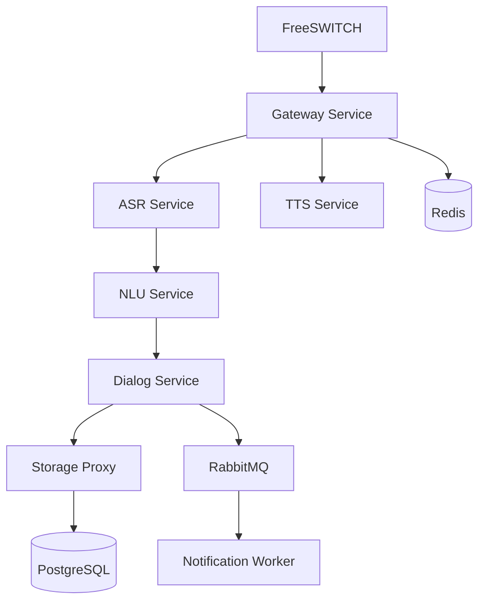

# Design Document: Voice Assistant Call Flow System

## Overview

This design specifies a comprehensive voice assistant call flow system that integrates with FreeSWITCH telephony infrastructure to provide real-time Russian language voice interaction capabilities. The system follows a microservices architecture with Domain-Driven Design principles, utilizing gRPC bidirectional streaming for low-latency audio processing.

The system processes incoming SIP calls through a Gateway Service that orchestrates audio streaming to specialized services: ASR for speech recognition, NLU for intent extraction, Dialog for conversation management, and TTS for speech synthesis. All services communicate asynchronously with PostgreSQL persistence and RabbitMQ messaging for notifications.

Key design principles:
- **Real-time Processing**: Sub-300ms latency for voice interaction
- **Russian Language Optimization**: Specialized models and processing
- **Pluggable Architecture**: Configurable ASR/NLU/TTS engines
- **Fault Tolerance**: Circuit breakers and graceful error recovery
- **Scalability**: Stateless services with external session storage

## Architecture

### High-Level Architecture


### Service Communication Flow

The system implements a pipeline architecture with the following communication patterns:

1. **FreeSWITCH Integration**: HTTP/REST API for call control and RTP audio streaming
2. **Audio Processing Pipeline**: gRPC bidirectional streaming between Gateway → ASR → NLU → Dialog
3. **Response Generation**: Dialog → TTS → Gateway → FreeSWITCH
4. **Persistence Layer**: Storage Proxy manages PostgreSQL transactions
5. **Event Broadcasting**: RabbitMQ topic exchange for async notifications

### Session Management Strategy

Sessions are managed using a distributed approach:
- **Session Store**: Redis for fast session state access
- **Session ID**: UUID generated per call, propagated through all services
- **State Isolation**: Each service maintains only relevant state portions
- **Cleanup**: Automatic session expiration and resource cleanup

## Components and Interfaces

### Gateway Service

**Responsibilities:**
- FreeSWITCH integration via mod_python3 hooks
- Session lifecycle management and routing
- Audio chunk streaming coordination
- Circuit breaker patterns for service resilience

**Key Interfaces:**
```python
class CallSession:
    session_id: UUID
    caller_id: str
    start_time: datetime
    state: SessionState
    audio_stream: AsyncIterator[AudioChunk]

class AudioStreamManager:
    async def stream_to_asr(session_id: UUID, audio: AudioChunk)
    async def stream_from_tts(session_id: UUID) -> AudioChunk
```

### ASR Service

**Responsibilities:**
- Real-time speech recognition using Vosk/Whisper.cpp
- Partial and final result generation
- Russian language model optimization
- Voice Activity Detection (VAD)

**Key Interfaces:**
```python
class ASRResult:
    text: str
    confidence: float
    is_final: bool
    timestamp: datetime

class ASRProcessor:
    async def process_audio_stream(session_id: UUID, audio_stream: AsyncIterator[AudioChunk]) -> AsyncIterator[ASRResult]
```
### NLU Service

**Responsibilities:**
- Intent classification from ASR transcriptions
- Entity extraction (items, quantities, dates)
- Confidence scoring and uncertainty handling
- Russian linguistic pattern recognition

**Key Interfaces:**
```python
class Intent:
    name: str
    confidence: float
    entities: Dict[str, Any]
    raw_text: str

class NLUProcessor:
    async def extract_intent(text: str, session_context: Dict) -> Intent
```

### Dialog Service

**Responsibilities:**
- Conversation state management
- Multi-turn dialog coordination
- Business logic orchestration (shopping lists, reminders)
- Error recovery and clarification prompts

**Key Interfaces:**
```python
class DialogState:
    current_intent: Optional[Intent]
    conversation_history: List[DialogTurn]
    pending_confirmations: List[str]
    context_variables: Dict[str, Any]

class DialogManager:
    async def process_intent(session_id: UUID, intent: Intent) -> DialogResponse
    async def handle_confirmation(session_id: UUID, response: str) -> DialogResponse
```

### TTS Service

**Responsibilities:**
- Russian speech synthesis using Silero TTS
- Audio format optimization for telephony
- Pronunciation and stress handling
- Response streaming for low latency

**Key Interfaces:**
```python
class TTSRequest:
    text: str
    voice_id: str
    sample_rate: int
    format: AudioFormat

class TTSProcessor:
    async def synthesize_speech(request: TTSRequest) -> AsyncIterator[AudioChunk]
```
### Storage Proxy

**Responsibilities:**
- PostgreSQL connection pooling and transaction management
- Shopping list and reminder persistence
- User preference storage
- Data consistency and integrity

**Key Interfaces:**
```python
class ShoppingList:
    id: UUID
    user_id: str
    items: List[ShoppingItem]
    created_at: datetime
    updated_at: datetime

class StorageRepository:
    async def save_shopping_list(list_data: ShoppingList) -> UUID
    async def get_user_lists(user_id: str) -> List[ShoppingList]
    async def add_list_item(list_id: UUID, item: ShoppingItem) -> None
```

### Notification Worker

**Responsibilities:**
- Asynchronous Telegram notification processing
- RabbitMQ message consumption
- Retry logic and failure handling
- Notification formatting and delivery

**Key Interfaces:**
```python
class NotificationEvent:
    event_type: str
    user_id: str
    payload: Dict[str, Any]
    timestamp: datetime

class NotificationProcessor:
    async def process_notification(event: NotificationEvent) -> bool
    async def send_telegram_message(user_id: str, message: str) -> bool
```

## Data Models

### Core Domain Entities

```python
@dataclass
class AudioChunk:
    data: bytes
    sample_rate: int
    channels: int
    timestamp: datetime
    duration_ms: int

@dataclass
class CallSession:
    session_id: UUID
    caller_id: str
    start_time: datetime
    end_time: Optional[datetime]
    state: SessionState
    metadata: Dict[str, Any]

@dataclass
class DialogTurn:
    session_id: UUID
    user_input: str
    system_response: str
    intent: Intent
    timestamp: datetime
    confidence: float
```
### Business Domain Models

```python
@dataclass
class ShoppingItem:
    name: str
    quantity: Optional[int]
    unit: Optional[str]
    added_at: datetime
    completed: bool = False

@dataclass
class Reminder:
    id: UUID
    user_id: str
    text: str
    due_date: datetime
    created_at: datetime
    completed: bool = False

@dataclass
class UserPreferences:
    user_id: str
    language: str = "ru"
    voice_id: str = "silero_ru_female"
    notification_enabled: bool = True
    telegram_chat_id: Optional[str] = None
```

### Protocol Buffer Definitions

```protobuf
// Audio streaming messages
message AudioChunk {
    bytes audio_data = 1;
    int32 sample_rate = 2;
    int32 channels = 3;
    int64 timestamp_ms = 4;
}

message ASRResult {
    string text = 1;
    float confidence = 2;
    bool is_final = 3;
    int64 timestamp_ms = 4;
}

message Intent {
    string name = 1;
    float confidence = 2;
    map<string, string> entities = 3;
    string raw_text = 4;
}

// Service communication
service ASRService {
    rpc ProcessAudioStream(stream AudioChunk) returns (stream ASRResult);
}

service NLUService {
    rpc ExtractIntent(IntentRequest) returns (IntentResponse);
}

service DialogService {
    rpc ProcessIntent(DialogRequest) returns (DialogResponse);
}

service TTSService {
    rpc SynthesizeSpeech(TTSRequest) returns (stream AudioChunk);
}
```
## Correctness Properties

*A property is a characteristic or behavior that should hold true across all valid executions of a system—essentially, a formal statement about what the system should do. Properties serve as the bridge between human-readable specifications and machine-verifiable correctness guarantees.*

Based on the prework analysis and property reflection, the following properties capture the essential correctness requirements for the voice assistant call flow system:

**Property 1: Session Lifecycle Management**
*For any* incoming SIP call, the Gateway Service should create a unique session, maintain its state throughout the call duration, and properly clean up all resources when the session terminates
**Validates: Requirements 1.1, 1.3, 1.4**

**Property 2: Audio Streaming Pipeline**
*For any* RTP audio input, the Gateway Service should split it into 200ms chunks, stream them to ASR Service, and receive both partial and final transcription results with proper timing
**Validates: Requirements 2.1, 2.2, 2.3, 2.4**

**Property 3: ASR Processing Consistency**
*For any* audio chunk received, the ASR Service should process it using the configured engine, generate appropriate partial results during streaming, and produce final results with confidence scores when speech segments complete
**Validates: Requirements 3.1, 3.2, 3.3, 3.5**

**Property 4: Intent Classification and Confidence Handling**
*For any* ASR transcription, the NLU Service should extract intents with confidence scores, classify them correctly for shopping/reminder/query types, and handle high/low confidence scenarios appropriately
**Validates: Requirements 4.1, 4.2, 4.3, 4.4, 4.5**

**Property 5: Dialog State Management**
*For any* conversation session, the Dialog Service should maintain context across multiple turns, generate appropriate responses based on current state, and handle confirmation workflows correctly
**Validates: Requirements 5.1, 5.2, 5.3, 5.4**

**Property 6: Speech Synthesis Pipeline**
*For any* response text, the TTS Service should synthesize Russian speech and the Gateway Service should stream the audio back to FreeSWITCH, handling special characters and numbers appropriately
**Validates: Requirements 6.1, 6.3, 6.5**

**Property 7: Data Persistence Operations**
*For any* shopping list or reminder operation, the Storage Proxy should persist changes transactionally to PostgreSQL, maintain data integrity during concurrent access, and handle queries with proper error handling
**Validates: Requirements 7.1, 7.2, 7.3, 7.4, 7.5**

**Property 8: Notification Event Processing**
*For any* shopping list change, the system should publish events to RabbitMQ, process them asynchronously through the Notification Worker, send formatted Telegram messages, and maintain delivery status with retry logic
**Validates: Requirements 8.1, 8.2, 8.3, 8.4, 8.5**

**Property 9: Error Recovery and Resilience**
*For any* error condition (low ASR confidence, NLU failure, service communication failure, or critical errors), the appropriate service should implement recovery strategies including user prompts, clarifying questions, error messages, timeouts, and detailed logging
**Validates: Requirements 9.1, 9.2, 9.3, 9.4, 9.5**

**Property 10: Service Communication Protocol**
*For any* inter-service communication, services should use gRPC with Protocol Buffers, implement service discovery registration, perform health checks, use circuit breaker patterns for failures, and log communication metrics
**Validates: Requirements 10.1, 10.2, 10.3, 10.4, 10.5**

**Property 11: Russian Language Processing**
*For any* Russian text input, the NLU Service should recognize Russian intent patterns and entities, the Dialog Service should provide grammatically correct Russian responses, and handle Russian-specific linguistic patterns like case declensions
**Validates: Requirements 12.2, 12.4, 12.5**
## Error Handling

### Error Categories and Recovery Strategies

**1. Audio Processing Errors**
- **Low Audio Quality**: ASR returns low confidence scores, Dialog Service prompts for repetition
- **Audio Stream Interruption**: Gateway Service implements buffering and reconnection logic
- **ASR Engine Failure**: Fallback to alternative ASR engine (Vosk ↔ Whisper.cpp)

**2. Intent Processing Errors**
- **Low NLU Confidence**: Dialog Service asks clarifying questions
- **Unknown Intent**: Dialog Service provides help menu or transfers to human operator
- **Entity Extraction Failure**: Dialog Service prompts for missing information

**3. Service Communication Errors**
- **gRPC Connection Failure**: Circuit breaker pattern with exponential backoff
- **Service Timeout**: Configurable timeout with graceful degradation
- **Protocol Buffer Serialization Error**: Detailed logging and error response

**4. Data Persistence Errors**
- **Database Connection Loss**: Connection pool retry with circuit breaker
- **Transaction Failure**: Rollback with user notification
- **Data Validation Error**: Detailed error message to user

**5. External Integration Errors**
- **FreeSWITCH Communication Error**: Session termination with cleanup
- **Telegram API Failure**: Retry queue with exponential backoff
- **RabbitMQ Connection Loss**: Message persistence and replay

### Circuit Breaker Implementation

```python
class CircuitBreaker:
    def __init__(self, failure_threshold: int = 5, timeout: int = 60):
        self.failure_threshold = failure_threshold
        self.timeout = timeout
        self.failure_count = 0
        self.last_failure_time = None
        self.state = CircuitState.CLOSED
    
    async def call(self, func: Callable, *args, **kwargs):
        if self.state == CircuitState.OPEN:
            if time.time() - self.last_failure_time > self.timeout:
                self.state = CircuitState.HALF_OPEN
            else:
                raise CircuitBreakerOpenError()
        
        try:
            result = await func(*args, **kwargs)
            self.reset()
            return result
        except Exception as e:
            self.record_failure()
            raise e
```

## Testing Strategy

### Dual Testing Approach

The system requires both unit testing and property-based testing for comprehensive coverage:

**Unit Tests**: Focus on specific examples, edge cases, and integration points
- Service startup and shutdown sequences
- Error condition handling with specific inputs
- FreeSWITCH integration scenarios
- Database transaction edge cases
- Telegram API failure scenarios

**Property-Based Tests**: Verify universal properties across all inputs
- Session management across random call patterns
- Audio processing with generated audio streams
- Intent classification with random Russian text
- Dialog state consistency across conversation flows
- Data persistence integrity with concurrent operations

### Property-Based Testing Configuration

**Framework**: Use Hypothesis for Python property-based testing
**Test Configuration**: Minimum 100 iterations per property test
**Test Tagging**: Each property test references its design document property

Example property test structure:
```python
@given(audio_chunks=audio_chunk_strategy())
@settings(max_examples=100)
def test_audio_streaming_pipeline_property(audio_chunks):
    """
    Feature: voice-assistant-call-flow, Property 2: Audio Streaming Pipeline
    For any RTP audio input, the Gateway Service should split it into 200ms chunks,
    stream them to ASR Service, and receive both partial and final transcription results
    """
    # Test implementation
```

### Integration Testing Strategy

**Service Integration**: Test service-to-service communication patterns
- Gateway ↔ ASR ↔ NLU ↔ Dialog pipeline
- Storage Proxy ↔ PostgreSQL transactions
- Notification Worker ↔ RabbitMQ ↔ Telegram API

**End-to-End Testing**: Simulate complete call flows
- Mock FreeSWITCH integration for call scenarios
- Test complete voice command processing pipelines
- Verify notification delivery workflows

**Performance Testing**: Validate latency requirements
- Audio processing latency under 300ms
- Intent processing under 100ms
- TTS synthesis under 500ms
- Concurrent session handling

### Test Data Management

**Russian Language Test Data**: Curated datasets for Russian voice processing
- Phoneme-specific audio samples for ASR testing
- Intent classification examples for NLU testing
- Grammar validation examples for Dialog testing

**Synthetic Data Generation**: Property-based test data generation
- Random audio chunk generation for streaming tests
- Random Russian text generation for NLU tests
- Random conversation flow generation for Dialog tests